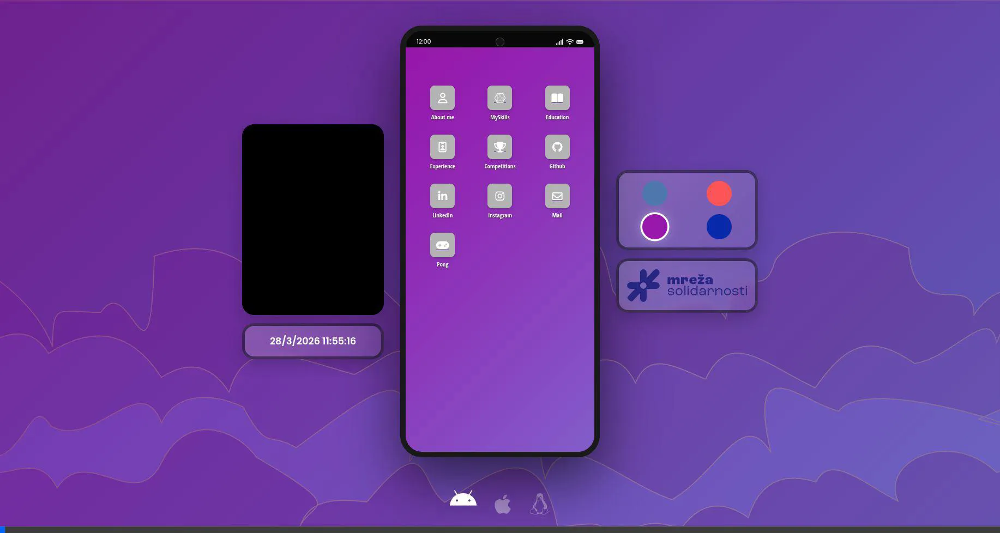
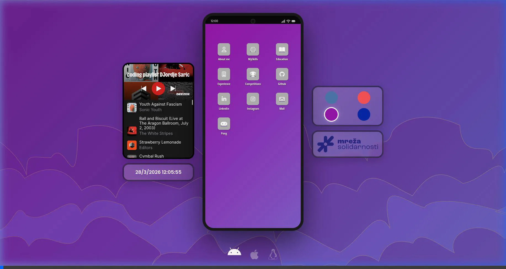

# Djordje Saric - Portfolio (Jaspr) 🚀


Welcome to my interactive, OS-like portfolio! This project is built using [Jaspr](https://github.com/schultek/jaspr), a modern web framework for Dart that feels like Flutter but compiles to lightweight HTML/CSS/JS.

> **🇷🇸 Scroll down for the Serbian version! / Skrolujte dole za verziju na srpskom!**

## 🌟 Highlights & Features

- **Interactive OS Simulation:** Browse my portfolio as if you are using an Android phone, iPhone, or Linux tablet! 
- **Theming:** Change the color and gradient themes on the fly.
- **App Launcher Interface:** All my details (Skills, Education, Experience, Competitions) are accessible as "apps" on the home screen.
- **Embedded Mini-Game:** Play a classic game of Pong straight from the launcher.
- **Responsive:** Fluid UI adapting to the selected simulated device frame.

## 📸 Demo

### 1. Portfolio Overview & Navigation
Watch how you can navigate through the portfolio, change devices, and update the background theme:



### 2. Playing Pong
Take a break and play some Pong! Here is a sneak peek:



## 🛠 Tech Stack
- **Framework:** Dart + Jaspr
- **Architecture:** Component-based (similar to Flutter widgets)
- **Deployment:** Compiled to static web files
- **Languages:** Dart, HTML, CSS

## 🚀 Getting Started Locally

Want to run this yourself? Follow these steps:

1. **Install Dart:** Make sure you have the Dart SDK installed (`>=3.5.0`).
2. **Activate Jaspr CLI:**
   ```bash
   dart pub global activate jaspr_cli
   ```
3. **Run the Development Server:**
   ```bash
   jaspr serve
   ```
4. Open `http://localhost:8080` in your browser.

## 📬 Contact
- **Email:** djordjesaric1999@gmail.com
- **LinkedIn:** [Djordje Saric](https://www.linkedin.com/in/djordjesaric493/)
- **GitHub:** [DjordjeSaric493](https://github.com/DjordjeSaric493)

---

# Đorđe Šarić - Portfolio (Jaspr) 🚀

Dobrodošli na moj interaktivni portfolio koji podseća na operativni sistem! Ovaj projekat je izrađen koristeći [Jaspr](https://github.com/schultek/jaspr), moderni web framework za programski jezik Dart, koji pišete kao Flutter, a kompajlira se u brz HTML/CSS/JS.

## 🌟 Glavne Funkcionalnosti

- **Simulacija Operativnog Sistema:** Pregledajte moj portfolio kao da koristite Android telefon, iPhone, ili Linux tablet!
- **Teme:** Promenite boje i pozadine jednim klikom.
- **Launcher sa Aplikacijama:** Svi moji podaci (Veštine, Obrazovanje, Iskustvo, Takmičenja) su dostupni kao "aplikacije" na početnom ekranu.
- **Ugrađena Mini-Igra:** Odigrajte partiju klasičnog Ponga direktno iz menija.
- **Responzivnost:** UI se prilagođava okviru izabranog uređaja.

## 📸 Demo

### 1. Pregled Portfolija i Navigacija
Pogledajte kako izgleda pretraga po portfoliju, menjanje uređaja i osvežavanje teme pozadine:


### 2. Igranje Ponga
Napravite pauzu i odigrajte malo Ponga! Evo kako to izgleda:


## 🛠 Tehnologije
- **Framework:** Dart + Jaspr
- **Arhitektura:** Komponentna (slično Flutter vidžetima)
- **Deployment:** Kompajlira se u statične web fajlove
- **Jezici:** Dart, HTML, CSS

## 🚀 Pokretanje Lokalne Verzije

Želite da pokrenete ovo na svom računaru? Pratite ove korake:

1. **Instalirajte Dart:** Proverite da li imate Dart SDK instaliran (`>=3.5.0`).
2. **Aktivirajte Jaspr CLI:**
   ```bash
   dart pub global activate jaspr_cli
   ```
3. **Pokrenite Development Server:**
   ```bash
   jaspr serve
   ```
4. Otvorite `http://localhost:8080` u vašem pregledaču.

## 📬 Kontakt
- **Email:** djordjesaric1999@gmail.com
- **LinkedIn:** [Đorđe Sarić](https://www.linkedin.com/in/djordjesaric493/)
- **GitHub:** [DjordjeSaric493](https://github.com/DjordjeSaric493)
